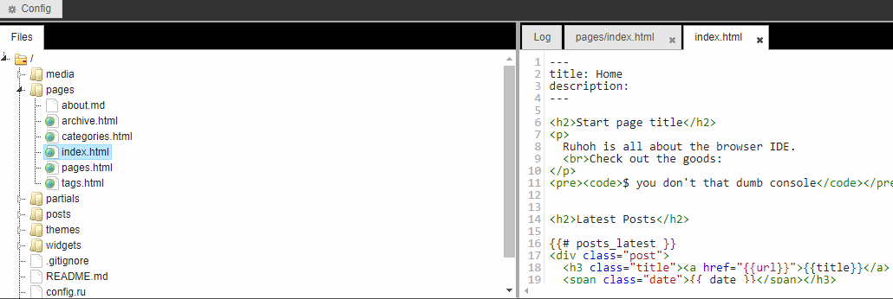

    

    
    
    

    Static website generator with dayside editor as cms.

## Description 
[Ruhoh](https://github.com/ruhoh/ruhoh.rb) implementation in Javascript.  
Based on Markdown and Yaml syntax to create web pages rapidly.

## Features
- Markdown syntax
- Yaml syntax
- Online editor as backend control panel
- Web page live preview 

## Installation
- Clone the repo with `--recursive` option for cloning submodules
- Goto `editor/index.htm`
- Enjoy the app

### License

App is [MIT licensed](./LICENSE).
